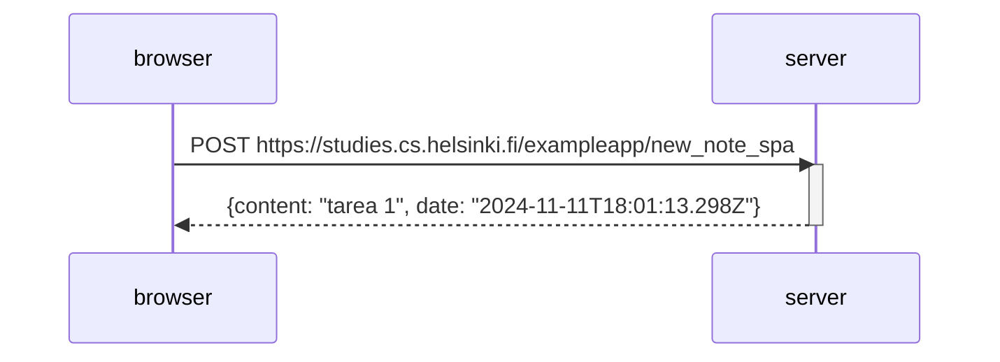

# Full-stack-open

## Part 0.6

```mermaid
sequenceDiagram
    participant browser
    participant server

    browser->>server: POST https://studies.cs.helsinki.fi/exampleapp/new_note_spa
    activate server
    server-->>browser: {content: "tarea 1", date: "2024-11-11T18:01:13.298Z"}
    deactivate server
```
